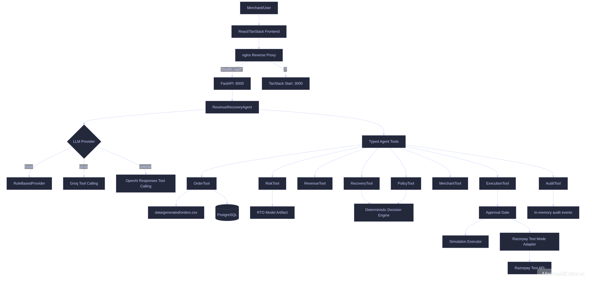
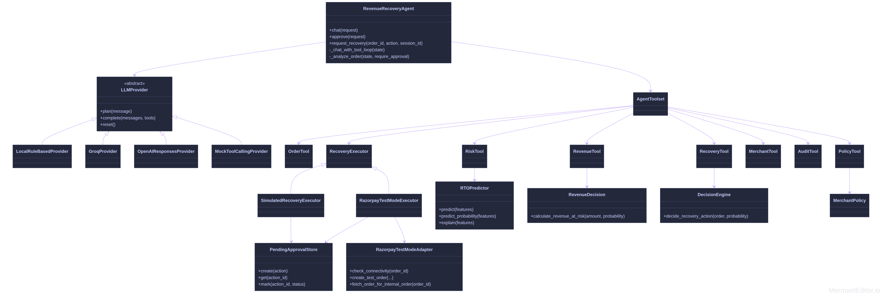

# AI Revenue Recovery Agent

<p align="center">
  
</p>

## Links

- **Docs:** [Notion Documentation](https://app.notion.com/p/RevenueHarness-AI-Revenue-Recovery-Agent-3d1d7856c985806ebc2ffe06f093033f?source=copy_link)
- **Live Demo:** [RevenueHarness — AI Revenue Recovery Agent](https://ai-revenue-recovery-agent-e3il.onrender.com/)
(Live demo sometimes not give AI responce because free groq API so clone repo and run using local model or with your own API key for better result 😊😊😊).

## Project Summary

An operations demo for Indian D2C revenue recovery. It analyzes synthetic Cash on Delivery orders, predicts Return-to-Origin (RTO) risk, calculates revenue at risk, and identifies policy-permitted recovery opportunities.

Risk and financial calculations remain deterministic. Ollama provides natural-language interaction and coordinates typed backend tools, while recovery execution remains protected by merchant policy and explicit approval.

## High-Level Design (HLD)
<p align="center">
  
</p>

## Low-Level Design (LLD)
<p align="center">
  
</p>


## Project Folder Structure

```text
AI-Revenue-Recovery-Agent/
├── backend/
│   ├── app/
│   │   ├── agent/
│   │   ├── api/
│   │   ├── core/
│   │   ├── db/
│   │   ├── decision/
│   │   ├── integrations/
│   │   ├── ml/
│   │   ├── models/
│   │   ├── services/
│   │   └── tools/
│   ├── tests/
│   └── pyproject.toml
├── data/
│   ├── generated/
│   ├── README.md
│   └── generate.py
├── docs/
├── evaluation/
├── frontend/
│   ├── src/
│   ├── Dockerfile
│   └── package.json
├── scripts/
│   ├── agent_smoke_test.py
│   └── ollama_smoke_test.py
├── docker/
│   ├── backend.Dockerfile
│   ├── hf-entrypoint.sh
│   └── hf-nginx.conf
├── Dockerfile
├── docker-compose.yml
├── .env.example
├── .gitignore
└── README.md
```

## Windows Setup

### Prerequisites

Install:

- Git for Windows
- Docker Desktop with Linux containers enabled
- Ollama for Windows

### Install Ollama

Install Ollama from [ollama.com/download](https://ollama.com/download), then open PowerShell:

```powershell
ollama serve
```

### Download Model

```powershell
ollama pull llama3.2:latest
ollama list
Invoke-RestMethod http://localhost:11434/api/tags
```

### Configure Environment

Clone the repository and create the environment file:

```powershell
git clone <repository-url>
Set-Location AI-Revenue-Recovery-Agent
Copy-Item .env.example .env
notepad .env
```

Set these values in `.env`:

```env
LLM_PROVIDER=ollama
LLM_MODEL=llama3.2:latest
OLLAMA_BASE_URL=http://host.docker.internal:11434
RAZORPAY_ENABLED=false
```

Keep credentials and API keys out of the repository.

### Run with Docker

```powershell
docker compose up -d --build
```

### Verify

```powershell
docker compose ps
Invoke-RestMethod http://localhost:8000/health
Invoke-RestMethod http://localhost:8000/api/v1/db/health
Invoke-RestMethod http://localhost:8000/api/v1/agent/status
```

Open `http://localhost:3000`.

### Stop

```powershell
docker compose down
```
## macOS Setup

### Prerequisites

Install:

- Git
- Docker Desktop
- Ollama

### Install Ollama

Install Ollama with the official macOS installer or Homebrew:

```bash
brew install --cask ollama
ollama serve
```

### Download Model

```bash
ollama pull llama3.2:latest
ollama list
curl http://localhost:11434/api/tags
```

### Configure Environment

```bash
git clone <repository-url>
cd AI-Revenue-Recovery-Agent
cp .env.example .env
```

Set these values in `.env`:

```env
LLM_PROVIDER=ollama
LLM_MODEL=llama3.2:latest
OLLAMA_BASE_URL=http://host.docker.internal:11434
RAZORPAY_ENABLED=false
```

Keep credentials and API keys out of the repository.

### Run with Docker

```bash
docker compose up -d --build
```

### Verify

```bash
docker compose ps
curl http://localhost:8000/health
curl http://localhost:8000/api/v1/db/health
curl http://localhost:8000/api/v1/agent/status
```

Open `http://localhost:3000`.

### Stop

```bash
docker compose down
```

## Linux Setup

### Prerequisites

Install:

- Git
- Docker Engine
- Docker Compose plugin
- Ollama

### Install Ollama

Install Ollama with the official installer:

```bash
curl -fsSL https://ollama.com/install.sh | sh
```

### Download Model

Configure Ollama for Docker host-gateway access, then start it:

```bash
OLLAMA_HOST=0.0.0.0:11434 ollama serve
```

In another terminal:

```bash
ollama pull llama3.2:latest
ollama list
curl http://localhost:11434/api/tags
```

### Configure Environment

```bash
git clone <repository-url>
cd AI-Revenue-Recovery-Agent
cp .env.example .env
```

Set these values in `.env`:

```env
LLM_PROVIDER=ollama
LLM_MODEL=llama3.2:latest
OLLAMA_BASE_URL=http://host.docker.internal:11434
RAZORPAY_ENABLED=false
```

Keep credentials and API keys out of the repository.

### Configure Docker → Ollama

The Compose configuration maps `host.docker.internal` to the host gateway for the backend container. No custom Docker network is required.

If UFW or another firewall blocks Docker-to-host traffic, allow TCP port 11434 only from the Docker bridge subnet. Do not expose Ollama to the public internet.

### Run with Docker

```bash
docker compose up -d --build
```

### Verify

```bash
docker compose ps
curl http://localhost:8000/health
curl http://localhost:8000/api/v1/db/health
curl http://localhost:8000/api/v1/agent/status
```

Open `http://localhost:3000`.

### Stop

```bash
docker compose down
```
